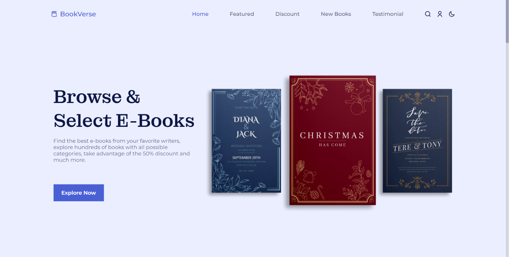
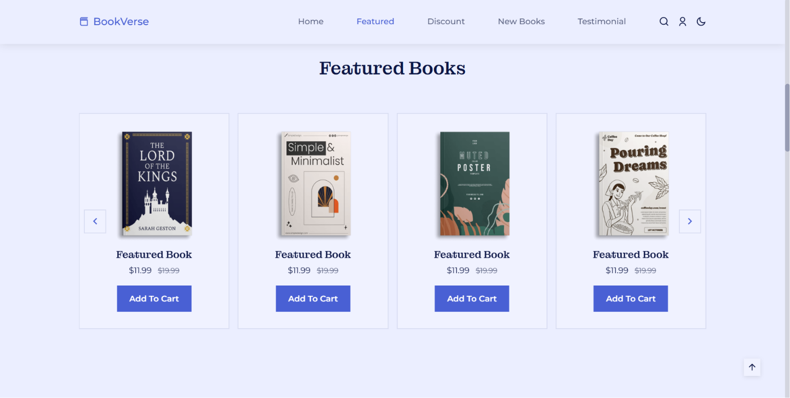
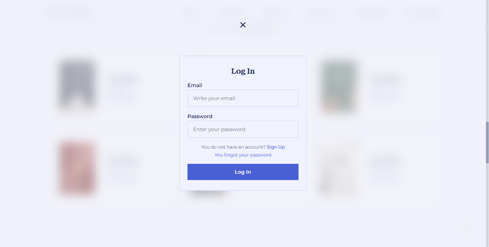
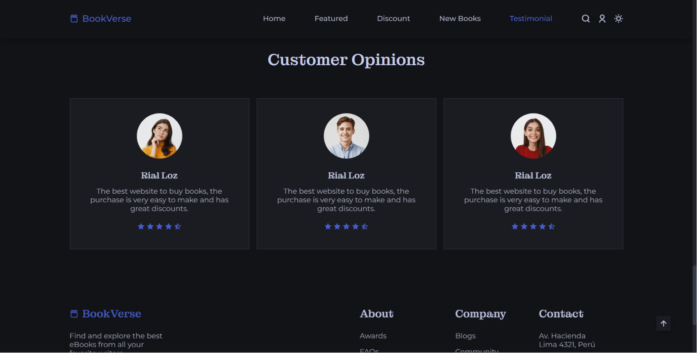

# 📚 BookVerse – Your Gateway to Endless Stories

**BookVerse** is a frontend web application designed to simulate a modern online bookstore experience. Users can browse book collections, explore categories, view featured books, and navigate through an interactive and responsive interface optimized for desktop and mobile devices.

---

## ✨ Features

- 📱 **Responsive Layout:** Works perfectly across desktops, tablets, and smartphones using Flexbox, Grid, and media queries.
- 🌗 **Theme Toggle:** Switch between Light and Dark mode with preference saved via localStorage.
- 🧠 **Interactive UI:** Smooth scroll, hover effects, and fade-in animations for engaging user interaction.
- 🗂️ **Book Categories:** Explore books by genres like Fiction, Romance, Sci-Fi, and more.
- 📖 **Featured Books Section:** Highlights recommended books with cover image, author, and star rating.
- 📨 **Newsletter Subscription:** Email form with JavaScript validation to keep users updated.
- 🧭 **Navigation & Footer:** Responsive navbar, quick links, and social icons using Font Awesome.

---

## 🛠️ Technologies Used

- 🧱 **HTML5** – Structure and layout
- 🎨 **CSS3** – Styling and responsiveness
- ⚙️ **JavaScript (Vanilla)** – Interactivity and dynamic features
- ⭐ **Font Awesome** – Icons for UI and social media
- 🔤 **Google Fonts** – Modern, readable typography

---

## 📸 Project Screenshots

### 🏠 Home Page



### 📚 Featured Books Section



### 👤 Login Section



### 🌙 Dark Mode



---

## 🚀 Setup and Installation

1. **Clone the Repository:**
```bash
git clone https://github.com/manika7105/BookVerse.git
```

2. **Open the Project:**
   Navigate to the project folder and open ```index.html``` in your browser.

3. **Customize (Optional):**
   * Modify ```main.js``` for additional interactions.
   * Update content in ```index.html``` to add new books or genres.
   * Adjust styles in ```styles.css``` for a personalized theme.

---

## 🧾 How to Use

1. Browse through the sections: Home, Featured, Categories, and Contact.
2. Use the 🌙 theme toggle to switch modes.
3. Explore your favorite genres by clicking category tiles.
4. Enter your email in the newsletter form and click **Subscribe** to stay updated.
5. On mobile, tap the hamburger menu to access navigation links.

---

## 🔮 Future Improvements

* 🧩 **Backend Integration:** Add Node.js, Express, and MongoDB for storing books, subscriptions, and user data.
* 👤 **User Accounts:** Save book lists, favorites, and user reviews.
* 🔍 **Live Search\Filter:** Real-time filtering of books by genre or title.
* 🛠️ **Admin Panel:** Easy management of book content.
* ♿ **Accessibility:** Enhance ARIA support and keyboard navigation.

---

## 📞 Contact

*   **Author:** Manika Goel
*   **LinkedIn:** www.linkedin.com/in/manika-goel-92201a286
*   **GitHub:** https://github.com/manika7105
*   **E-mail:** goelmanika07@gmail.com
